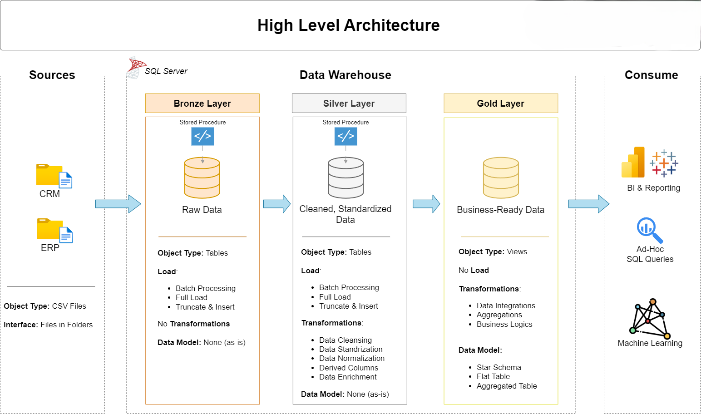

# 📊 Data Warehouse & Analytics Project (Medallion Architecture - SQL Server)

Welcome to the **Data Warehouse & Analytics Project** repository!  
This project demonstrates a **modern data warehousing solution** using the **Medallion Architecture (Bronze, Silver, Gold)** in **SQL Server**. It is designed as a portfolio piece to showcase data engineering, ETL pipelines, and SQL-based analytics following industry best practices.

---

## 🚀 Project Overview

This project builds a complete data pipeline from raw data ingestion to business-ready insights. It simulates integrating data from **CRM** and **ERP** systems to support analytics and decision-making for sales, customers, and products.

---

## 🏗️ Data Architecture

The data architecture follows the **Medallion Architecture**, which organizes the pipeline into three logical layers: **Bronze (Raw)**, **Silver (Cleaned)**, and **Gold (Business-Ready)**.

<p align="center">
  
</p>

### 🔸 Bronze Layer
- **Source**: CSV files from CRM & ERP systems
- **Object Type**: Tables
- **Load**: Batch processing, truncate & insert
- **Transformations**: None (raw, as-is)
- **Purpose**: Raw data storage for traceability and reproducibility

### ⚪ Silver Layer
- **Object Type**: Tables
- **Load**: Batch processing
- **Transformations**:  
  - Data cleansing  
  - Standardization  
  - Normalization  
  - Enrichment  
  - Derived columns
- **Purpose**: Prepare and harmonize data for analytics

### 🟨 Gold Layer
- **Object Type**: Views
- **Transformations**:  
  - Joins and integration  
  - Aggregations  
  - Business logic
- **Data Models**:  
  - Star schema  
  - Flat tables  
  - Aggregated tables
- **Purpose**: Final model for reporting and decision-making

---

## 🔄 Data Lineage (Flow)

This diagram illustrates how data flows through the architecture layers:

<p align="center">
  
</p>

- Source CSV files → Bronze tables (raw data)
- Bronze tables → Silver tables (cleaned data)
- Silver tables → Gold views (`fact_sales`, `dim_customers`, `dim_products`)

---

## 🧠 Key Skills & Concepts

✅ SQL Development (T-SQL)  
✅ ETL Pipeline Design (Stored Procedures)  
✅ Data Warehousing  
✅ Medallion Architecture  
✅ Dimensional Modeling (Star Schema)  
✅ Data Cleansing & Standardization  
✅ Analytics with SQL Views  
✅ Git-Based Version Control

---

## 📊 Business Use Case

The warehouse enables insights into:

- 🧍‍♂️ **Customer Behavior**: Segment performance, active customers
- 🛍 **Product Performance**: Best/worst selling products
- 📈 **Sales Trends**: Monthly, quarterly trends and growth
- 🗺 **Geographical Analysis**: Sales by location (if extended)

---

## 🛠 Tools & Technologies

| Tool                     | Purpose                                 |
|--------------------------|-----------------------------------------|
| **SQL Server Express**   | Relational database engine              |
| **SSMS**                 | Query and data management GUI          |
| **CSV Files**            | Simulated ERP & CRM source systems     |
| **Draw.io**              | Architecture & data flow diagrams      |
| **Git & GitHub**         | Source control and collaboration       |

---

## 📁 Project Structure

```bash
├── /images/                        # Diagrams (architecture + lineage)
│   ├── architecture-diagram.png
│   └── data-lineage-diagram.png
├── /scripts/                       # SQL scripts (ETL and modeling)
│   ├── 01_bronze_load.sql
│   ├── 02_silver_transform.sql
│   ├── 03_gold_modeling.sql
│   └── 04_reporting_queries.sql
├── /data/                          # Source CSV files
│   ├── crm_cust_info.csv
│   ├── crm_sales_details.csv
│   ├── crm_prd_info.csv
│   ├── erp_cust_az12.csv
│   ├── erp_loc_a101.csv
│   └── erp_px_cat_g1v2.csv
├── README.md
